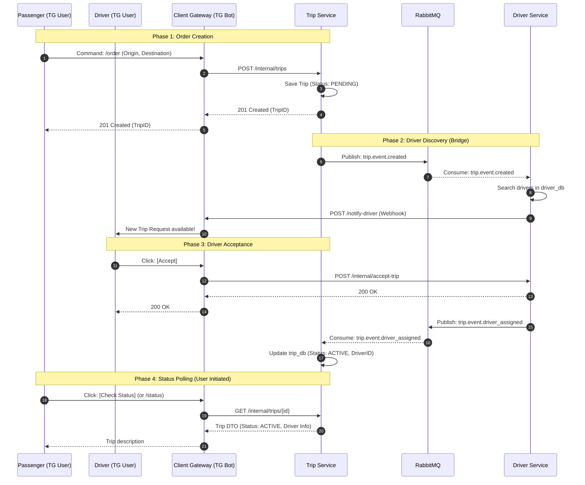

# AI Context: drive-ops

## 1. Project Overview & Architecture
**Project:** drive-ops (Ride-Sharing Platform)

**Architecture:** Microservices

**Database Pattern:** Database-per-service (No shared tables).

**Communication Channels:**
* **Synchronous (HTTP/REST):**
  * `TG User` <-> `Client Gateway` (Telegram API)
  * `Client Gateway` -> `Trip Service` (Create Order / Poll Status)
  * `Client Gateway` -> `Driver Service` (Accept Order)
  * `Driver Service` -> `Client Gateway` (Webhook: Notify Driver)
* **Asynchronous (RabbitMQ):**
  * `Trip Service` -> `Driver Service` (Topic: `trip.event.created`)
  * `Driver Service` -> `Trip Service` (Topic: `trip.event.driver_assigned`)

## 2. Infrastructure & DevOps Principles
**Environment:**
* **Local Development:** Virtualized via **Vagrant** (Debian 12 / Ubuntu).
* **Containerization:** **Docker** & **Docker Compose V2**.
* **Hot-Reloading:** Source code mounted via Symlinks (Ansible `state: link`) to `/opt/drive-ops`.

**Provisioning (IaC):**
* **Tool:** **Ansible**.
* **Strategy:** Roles-based deployment.
* **Orchestration:** `playbook.yaml` prepares the VM, installs Docker, and launches services via Compose.

**CI/CD & Quality:**
* **Version Control:** GitHub.
* **Hooks:** `pre-commit` (Linting/Formatting) located in `scripts/hooks`.
* **CI:** GitHub Actions (defined in `.github/`).

## 3. System Data Flow (Source of Truth)
This diagram defines the canonical flow for Ride Creation and Assignment.

### Phase 1: Order Creation (Steps 1-5)
* Step 1-2: Client Gateway (TG Bot) receives the /order command and forwards a synchronous POST request to /internal/trips in the Trip Service.

* Step 3: Trip Service persists the trip record in trip_db with an initial status: PENDING.

* Step 4-5: Trip Service returns a 201 Created response with the TripID. The Gateway then confirms the order to the Passenger via Telegram.

### Phase 2: Driver Discovery (Steps 6-10)
* Step 6-7: Trip Service triggers matching by publishing a trip.event.created message to RabbitMQ. Driver Service consumes this event.

* Step 8: Driver Service executes search logic in driver_db (using PostGIS or radius search) to find available drivers.

* Step 9-10: Driver Service sends a POST request to the Gateway's Webhook (/notify-driver). The Client Gateway then pushes a Telegram message with an Inline "Accept" Button to the matched drivers.

### Phase 3: Driver Acceptance (Steps 11-17)
* Step 11-12: The Driver clicks [Accept], and the Client Gateway forwards a POST request to /internal/accept-trip in the Driver Service.

* Step 13-14: Driver Service validates the request and returns 200 OK. The Gateway notifies the Driver that they are successfully assigned.

* Step 15-16: Driver Service publishes a trip.event.driver_assigned message to RabbitMQ. Trip Service consumes this event to sync the state.

* Step 17: Trip Service updates the trip record in trip_db: changes status to ACTIVE and maps the DriverID to the TripID.

### Phase 4: Status Polling (Steps 18-21)
* Step 18-19: The Passenger triggers a status check (/status or button). The Client Gateway performs a synchronous GET request to /internal/trips/{id} in the Trip Service.

* Step 20-21: Trip Service returns a Trip DTO containing the current status and driver details. The Client Gateway parses this DTO and sends a formatted "Trip description" message to the Passenger.

## 4. Directory Structure
* `client-gateway/` - Telegram Bot Gateway (Python). BFF for handling user interactions via Telegram API.
* `driver-service/` - Driver Service (Python, Postgres, PostGIS). Manages driver availability and geospatial search.
* `trip-service/` - Trip Service (Go, Postgres). Handles trip lifecycle and state management.
* `infra/` - Infrastructure as Code (Ansible, Vagrant). Server provisioning and local VM setup.
* `scripts/hooks/`: Contains `pre-commit` script to enforce linting/formatting before commits.
* `documentation/` - Project documentation and architecture diagrams.
* `.github/` - CI/CD workflows (GitHub Actions).
* `docker-compose.yml` - Local development environment orchestration (RabbitMQ, DBs, Services).
* `.env.example` - Configuration template. Contains keys for Database credentials, RabbitMQ URLs, and Service Ports. Must be copied to `.env`.

### `client-gateway/`
**Role:** Telegram Bot Interface (BFF).
**Language:** Python.
**Dependencies:** Defined in `requirements.txt`.
**Structure:**
* `bot/`: Core application logic.
  * `main.py`: Entry point. Initializes the bot and webhook listeners.
  * `passenger.py`: Handlers for passenger commands (e.g., `/order`, status checks).
  * `driver.py`: Handlers for driver interactions (e.g., accepting trips via buttons).
  * `logger_utils.py`: Logging configuration.
* `Dockerfile`: Python container configuration for deployment.
* `tests/`: Unit and integration tests for bot logic.

### `driver-service/`
**Role:** Driver Management & Geospatial Search.
**Language:** Python.
**Dependencies:** Defined in `requirements.txt`.
**Structure:**
* `src/`: Core application source code.
  * `clients/`: Outbound communication.
    * `gateway_client.py`: HTTP client for calling Client Gateway webhooks.
    * `rabbitmq_publisher.py`: Publishes events (`trip.event.driver_assigned`).
  * `consumers/`: Inbound RabbitMQ handlers.
    * `trip_events_consumer.py`: Listens for `trip.event.created` (New ride requests).
    * `driver_response_consumer.py`: Handles asynchronous driver responses or status updates.
  * `services/`: Core Business Logic.
    * `driver_notification_service.py`: Logic to find and notify drivers.
    * `driver_response_service.py`: Logic to handle driver acceptance actions.
  * `schemas/`: Pydantic models (Data Transfer Objects).
    * `trip_request.py`: Schema for incoming trip data.
    * `driver_response.py`: Schema for driver actions (Accept/Decline).
  * `main.py`: App entry point & dependency injection.
  * `config.py`: Environment configuration.
* `Dockerfile`: Container configuration.
* `tests/`: Unit tests for driver logic.

### `trip-service/`
**Role:** Trip Lifecycle & State Management.
**Language:** Go (Golang).
**Architecture:** Standard Go Project Layout (Clean Architecture).
**Structure:**
* `cmd/server/`:
  * `main.go`: Application entry point. Bootstraps DB, RabbitMQ, and HTTP server.
* `db/`: Database management.
  * `migrations/`: SQL migration files (`up`/`down`) for PostgreSQL.
  * `seeds/`: Initial data for development (`sample_trips.sql`).
* `internal/`: Private application code (Library pattern).
  * `api/http/`: HTTP Transport layer.
    * `handler.go`: REST API handlers (e.g., POST /internal/trips).
  * `broker/`: Asynchronous Messaging (RabbitMQ).
    * `publisher.go`: Sends events (e.g., `trip.event.created`).
    * `events.go`: Broker-specific definitions (Topic names, Routing Keys, Payload structs).
    * `consumer.go`: Listens for events (e.g., `trip.event.driver_assigned`).
    * `config.go`: RabbitMQ connection settings.
  * `domain/`: Core Business Entities.
    * `trip.go`: Struct definitions (Trip model).
    * `events.go`: Event payload structures.
  * `repository/`: Data Access Layer (PostgreSQL).
    * `trip_repository.go`: SQL queries and DB interactions.
    * `trip_repository_test.go`: Unit tests co-located with source code following Go standards.
  * `service/`: Business Logic Layer.
    * `trip_service.go`: Orchestrates flow between Repository and Broker.
    * `trip_mock.go`: Mocks for unit testing.
* `tests/integration/`: End-to-end integration tests.
* `go.mod` / `go.sum`: Go module definitions.
* `Dockerfile` & `Dockerfile.migrations`: Container configurations for App and Migrator.

### `infra/`
**Role:** Infrastructure as Code (IaC) & Local Development Environment.
**Tools:** Ansible, Vagrant, Docker.
**Structure:**
* `ansible/`: Configuration Management.
  * `inventory/`: Defines target environments.
    * `hosts`: Production/Staging inventory.
    * `localhost`: Local development inventory.
  * `roles/`: Modular tasks for provisioning services.
    * `client-gateway/`: Tasks to deploy the Python Bot.
    * `driver-service/`: Tasks to deploy the Driver Backend (Python).
    * `trip-service/`: Tasks to deploy the Trip Backend (Go).
    * `docker/`: Installs Docker engine and dependencies.
    * `infra/`: Creates `/opt/drive-ops` root. Securely copies `.env` and `docker-compose.yml`. Starts `db`, `mq` and waits for health checks.
  * `playbook.yaml`: Main entry point orchestrating all roles.
* `postgres/init-db/`:
  * `init.sql`: Bootstrap script for driver_db.
  * `Note on DB Initialization`: The trip_db is automatically created by the container's POSTGRES_DB environment variable. Since Postgres only auto-creates one database on startup, driver_db must be initialized manually via this script.
* `vagrant/`: Virtual Machine configuration.
  * `Vagrantfile`: Ruby-based config defining the local VM (OS, Network, Resources).
