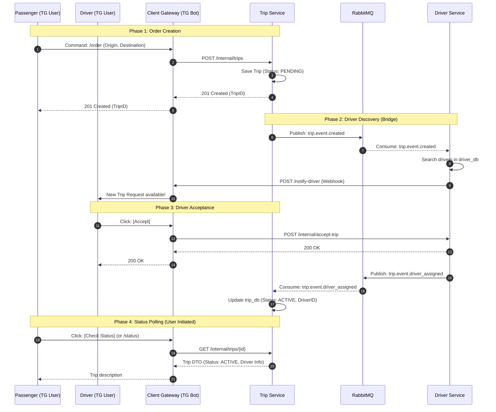

# AI Context: drive-ops

## 1. Project Overview & Architecture
**Project:** drive-ops (Ride-Sharing Platform)
**Architecture:** Microservices
**Database Pattern:** Database-per-service (No shared tables).
**Communication Channels:**
* **Synchronous (HTTP/REST):**
    * `TG User` <-> `Client Gateway` (Telegram API)
    * `Client Gateway` -> `Trip Service` (Create Order / Poll Status)
    * `Client Gateway` -> `Driver Service` (Accept Order)
    * `Driver Service` -> `Client Gateway` (Webhook: Notify Driver)
* **Asynchronous (RabbitMQ):**
    * `Trip Service` -> `Driver Service` (Topic: `trip.created`)
    * `Driver Service` -> `Trip Service` (Topic: `trip.driver_assigned`)

### System Data Flow (Source of Truth)
This diagram defines the canonical flow for Ride Creation and Assignment.

