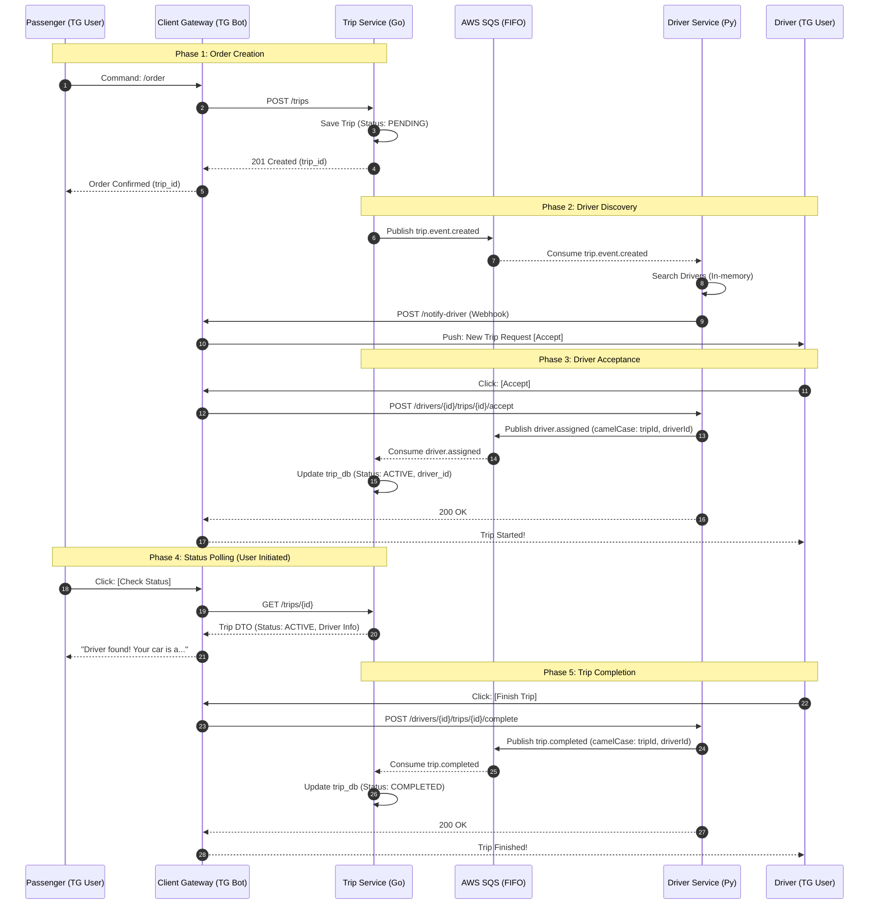

# AI Context: drive-ops

## 1. Project Overview & Architecture
**Project:** drive-ops (Ride-Sharing Platform)

**Architecture:** Microservices

**Database Pattern:** Database-per-service (No shared tables).

**Communication Channels:**
* **Synchronous (HTTP/REST):**
  * `TG User` <-> `Client Gateway` (Telegram API)
  * `Client Gateway` -> `Trip Service` (Create Order / Poll Status)
  * `Client Gateway` -> `Driver Service` (Accept Order)
  * `Driver Service` -> `Client Gateway` (Webhook: Notify Driver)
* **Asynchronous (AWS SQS):**
  * `Trip Service` -> `Driver Service` (Queue: `trip-created-dev.fifo`)
  * `Driver Service` -> `Trip Service` (Queue: `driver-assigned-dev.fifo`)
  * `Driver Service` -> `Trip Service` (Queue: `trip-completed-dev.fifo`)

## 2. Infrastructure & DevOps Principles
**Environment:**
* **Local Development:** Virtualized via **Vagrant** (Debian 12 / Ubuntu).
* **Containerization:** **Docker** & **Docker Compose V2**.
* **Hot-Reloading:** Source code mounted via Symlinks (Ansible `state: link`) to `/opt/drive-ops`.

**Provisioning (IaC):**
* **Tool:** **Ansible**.
* **Strategy:** Roles-based deployment.
* **Orchestration:** `playbook.yaml` prepares the VM, installs Docker, and launches services via Compose.

**CI/CD & Quality:**
* **Version Control:** GitHub.
* **Hooks:** `pre-commit` (Linting/Formatting) located in `scripts/hooks`.
* **CI:** GitHub Actions (defined in `.github/`).

## 3. System Data Flow (Source of Truth)
This diagram defines the canonical flow for Ride Creation and Assignment.

### Phase 1: Order Creation (Synchronous)

1.  **Passenger Command:** The Passenger sends a `/order` command to the Telegram Bot (Client Gateway).
2.  **Internal Request:** The Client Gateway parses the message and makes a synchronous **POST** `/trips` request to the Trip Service.
3.  **Persist Pending Trip:** The Trip Service saves the trip details into `trip_db` with an initial status of **PENDING**.
4.  **Service Confirmation:** The Trip Service returns a **201 Created** response containing the unique `trip_id` to the Gateway.
5.  **User Acknowledgment:** The Client Gateway sends a Telegram message back to the Passenger confirming the order.

### Phase 2: Driver Discovery (Asynchronous Bridge)

6.  **Event Publishing:** The Trip Service triggers matching by publishing a `trip.event.created` message to the **AWS SQS** queue.
7.  **Event Consumption:** The Driver Service consumes the `trip.event.created` message from the queue.
8.  **Driver Search:** The Driver Service executes in-memory search logic to find available drivers.
9.  **Notification Webhook:** The Driver Service sends a **POST** `/notify-driver` request to the Client Gateway's webhook.
10. **Push Notification:** The Client Gateway pushes a Telegram message with an **[Accept]** button to the Driver.

### Phase 3: Driver Acceptance (Hybrid Flow)

11. **Driver Action:** The Driver clicks the **[Accept]** button in Telegram.
12. **Acceptance Request:** The Client Gateway sends a **POST** `/drivers/{id}/trips/{id}/accept` request to the Driver Service.
13. **Event Publishing:** The Driver Service publishes a `driver.assigned` event to SQS (using **camelCase** keys: `tripId`, `driverId`).
14. **Event Consumption:** The Trip Service consumes the `driver.assigned` event.
15. **State Synchronization:** The Trip Service updates `trip_db`, changing the status to **ACTIVE** and linking the `driver_id`.
16. **Internal Confirmation:** The Driver Service returns a **200 OK** to the Client Gateway.
17. **Driver Feedback:** The Client Gateway updates the Driver's chat to confirm "Trip Started!".

### Phase 4: Status Polling (User Initiated)

18. **Status Request:** The Passenger clicks **[Check Status]**.
19. **Fetch Data:** The Client Gateway makes a synchronous **GET** `/trips/{id}` call to the Trip Service.
20. **Data Transfer:** The Trip Service returns the Trip DTO (Status: **ACTIVE**, Driver Info).
21. **User Update:** The Client Gateway sends the driver details (e.g., "Driver found!") to the Passenger.

### Phase 5: Trip Completion (Asynchronous Finalization)

22. **Driver Action:** The Driver clicks **[Finish Trip]** in Telegram.
23. **Completion Request:** The Client Gateway sends a **POST** `/drivers/{id}/trips/{id}/complete` request to the Driver Service.
24. **Event Publishing:** The Driver Service publishes a `trip.completed` event to SQS (using **camelCase** keys).
25. **Event Consumption:** The Trip Service consumes the `trip.completed` event.
26. **State Synchronization:** The Trip Service updates `trip_db`, changing the status to **COMPLETED**.
27. **Internal Confirmation:** The Driver Service returns a **200 OK** to the Client Gateway.
28. **Final Feedback:** The Client Gateway sends a "Trip Finished!" message to the Driver.

## 4. Directory Structure
* `client-gateway/`: **Telegram Bot Gateway** (Python). BFF for handling user interactions via Telegram API.
* `driver-service/`: **Driver Service** (Python, Postgres). Manages driver availability and geospatial search.
* `trip-service/`: **Trip Service** (Go, Postgres). Handles trip lifecycle and state management.
* `infra/`: **Infrastructure as Code** (Ansible, Vagrant). Server provisioning and local VM setup.
* `scripts/`: Helper scripts (e.g., `hooks/pre-commit` for linting).
* `documentation/`: Project documentation and architecture diagrams.
* `.github/`: **CI/CD Workflows**. GitHub Actions for build and deployment.
* `docker-compose.yml`: Local orchestration for **Services** and **Databases** (Postgres). Connects to real AWS SQS.
* `.env.example`: Configuration template.
* `.coderrabbit.yaml`: AI Code Review configuration.
* `CONTRIBUTING.md`: Guidelines for contributing to the project.

### `client-gateway/`
**Role:** Telegram Bot Interface (BFF).
**Language:** Python.
**Structure:**
* `bot/`: Core application logic.
  * `main.py`: Entry point. Initializes the bot and webhook listeners.
  * `api_client.py`: **Internal HTTP Client**. Wraps async calls (`httpx`) to `trip-service` and `driver-service`.
  * `passenger.py`: Handlers for passenger commands (e.g., `/order`, status checks).
  * `driver.py`: Handlers for driver interactions (e.g., accepting trips via buttons).
  * `logger_utils.py`: Logging configuration and correlation ID generation.
  * `.env.example`: Template for bot-specific environment variables.
* `tests/`: Unit and integration tests for bot logic.
* `Dockerfile`: Container configuration for deployment.
* `requirements.txt`: Python dependencies (pinned `python-telegram-bot`, `fastapi`, `httpx`).
* `README.md`: Service-specific documentation.

### `driver-service/`
**Role:** Driver Management & Geospatial Search.
**Language:** Python.
**Structure:**
* `alembic.ini`: **Alembic Configuration**. Root config for migrations.
* `alembic/`: **Database Migrations**. Managed via Alembic (SQLAlchemy).
  * `versions/`: Migration scripts.
  * `env.py`: Migration environment configuration.
  * `script.py.mako`: Template for new migrations.
* `src/`: Core application source code.
  * `clients/`: Outbound communication.
    * `gateway_client.py`: HTTP client for calling Client Gateway webhooks.
    * `sqs_publisher.py`: **SQS Publisher**. Sends `camelCase` events to AWS.
    * `rabbitmq_publisher.py`: **Legacy**. Deprecated RabbitMQ publisher.
  * `consumers/`: Inbound SQS handlers.
    * `trip_sqs_consumer.py`: **Main SQS Consumer**. Polls `trip.created` events from AWS.
    * `trip_events_consumer.py`: Legacy consumer logic.
    * `driver_response_consumer.py`: Handles driver responses.
  * `schemas/`: Pydantic models (Data Transfer Objects).
    * `trip_request.py`: Schema for incoming trip data.
    * `driver_response.py`: Schema for driver actions.
    * `driver_schemas.py`: Internal driver data schemas.
    * `bot_user_schemas.py`: Schemas for Telegram user persistence.
  * `services/`: Core Business Logic.
    * `driver_notification_service.py`: Logic to find and notify drivers.
    * `driver_response_service.py`: Logic to handle driver acceptance.
    * `driver_repository.py`: **Data Access Layer**. Abstraction for DB queries.
    * `bot_user_repository.py`: Logic for managing Telegram user state in DB.
  * `utils/`:
    * `geo.py`: Geospatial calculations.
  * `main.py`: App entry point & dependency injection.
  * `config.py`: Environment configuration (Pydantic Settings).
  * `database.py`: **DB Connection**. Handles SQLAlchemy engine/session.
  * `driver_models.py`: **ORM Models**. Defines `Driver` table schema.
  * `seed_demo.py`: Script to seed initial dummy data.
* `CONTRIBUTING.md`: Contribution guidelines.
* `Dockerfile`: **Main Service**. Container configuration.
* `Dockerfile.migrations`: **Migration Runner**. Dedicated container for Alembic.
* `requirements.txt`: Python dependencies.
* `tests/`: Unit tests.

### `trip-service/`
**Role:** Trip Lifecycle & State Management.
**Language:** Go (Golang).
**Architecture:** Standard Go Project Layout (Clean Architecture).
**Structure:**
* `cmd/server/`: Main application entry point.
  * `main.go`: Service initialization and dependency injection.
* `db/`: Database management.
  * `migrations/`: SQL migration files (`up`/`down`).
  * `seeds/`: Initial data for development.
* `docs/`: **Service Documentation**.
  * `CI_TESTING.md`: Testing guidelines.
  * `MIGRATIONS.MD`: Database migration guide.
  * `trip-events.md`: Event schema documentation.
* `internal/`: Private code (Library pattern).
  * `api/http/`: REST API handlers.
    * `handler.go`: REST API handlers (e.g., `POST /trips`).
  * `broker/`: SQS Publisher/Consumer implementation.
    * `config.go`: Broker configuration settings.
    * `consumer.go`: Base consumer interface.
    * `sqs_consumer.go`: **SQS Implementation**. Handles `driver.assigned` and `trip.completed` events.
    * `sqs_publisher.go`: **SQS Publisher Implementation**. Publishes `trip.created` with FIFO deduplication.
    * `publisher.go`: Message publisher interface.
    * `events.go`: Event builders and payload structures.
  * `domain/`: Struct definitions and Domain Errors.
    * `trip.go`: Core entities and errors (`ErrInvalidTripStatus`, etc.).
    * `events.go`: Event structs (`TripCreatedEvent`, etc.).
  * `repository/`: Data Access Layer (GORM).
    * `trip_repository.go`: DB operations (Atomic updates, locking).
    * `trip_repository_test.go`: Integration tests (Testcontainers).
  * `service/`: Business Logic.
    * `trip_service.go`: Service orchestration.
    * `trip_mock.go`: Mock implementations for testing.
* `tests/`: System-wide integration tests.
* `Dockerfile`: Container configuration for the Go app.
* `Dockerfile.migrations`: **Migration Runner**. Uses `migrate/migrate`.
* `go.mod` / `go.sum`: Go module definitions and checksums.
* `run-migrations.sh`: Entrypoint script for the migration container.

### `infra/`
**Role:** IaC & Local Development.
**Structure:**
* `ansible/`: Modular roles for environment provisioning.
  * `inventory/`: Target environments.
    * `hosts`: Production/Staging inventory file.
    * `localhost`: Local development inventory file.
  * `roles/`:
    * `client-gateway/`: **Python Bot Deployment**. Symlinks source code to `/opt/drive-ops` to enable hot-reloading. Deploys container via Docker Compose.
    * `docker/`: **Engine Setup**. Installs Docker Engine, Buildx plugin, and `python3-docker` SDK. Handles GPG keys and architecture mapping (AMD64/ARM64).
    * `driver-service/`: **Driver Backend Deployment**. Symlinks source code. Orchestrates both `driver-service` and `driver-migrations` containers.
    * `infra/`: **Core Environment Setup**. Creates `/opt/drive-ops` root. Securely copies `.env` and `docker-compose.yml`. Starts shared services (`db`, `localstack` for SQS) and waits for health checks (ports 5432/4566).
    * `trip-service/`: **Go Backend Deployment**. Symlinks source code. Orchestrates both `trip-service` and `trip-migrations` containers.
  * `playbook.yaml`: Main entry point orchestrating all roles.
* `postgres/init-db/`:
  * `init.sql`: **Database Creation Only**. Executes `CREATE DATABASE driver_db`.
  * **Note on Schema:** Tables are **NOT** created here. The `drivers` table schema is managed via Alembic migrations located in `driver-service/alembic/`.
  * **Note on DB Initialization:** The `trip_db` is automatically created by the container's `POSTGRES_DB` environment variable. `driver_db` is manually created via this script to support the microservices pattern.
* `vagrant/`: Virtual Machine configuration.
  * `Vagrantfile`: Ruby-based config defining the local VM (OS, Network, Resources).
