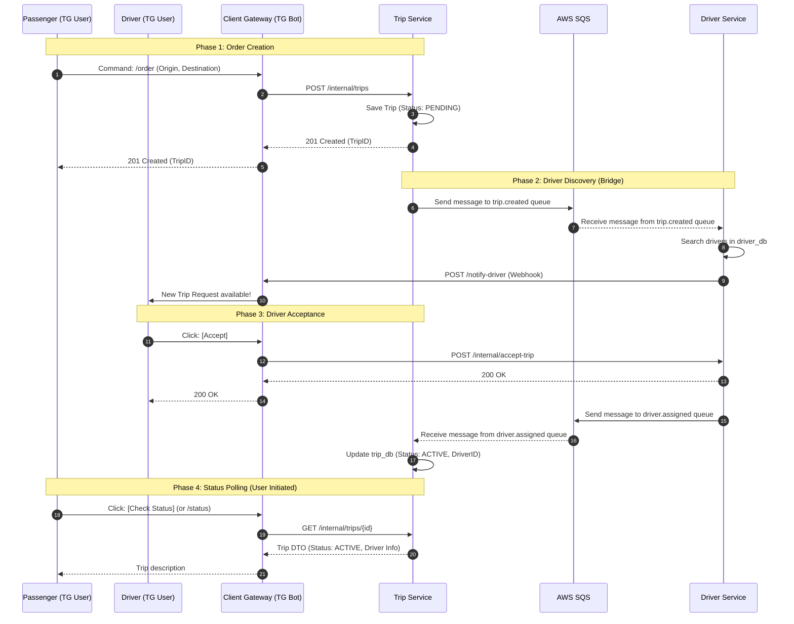

# AI Context: drive-ops

## 1. Project Overview & Architecture
**Project:** drive-ops (Ride-Sharing Platform)

**Architecture:** Microservices

**Database Pattern:** Database-per-service (No shared tables).

**Communication Channels:**
* **Synchronous (HTTP/REST):**
  * `TG User` <-> `Client Gateway` (Telegram API)
  * `Client Gateway` -> `Trip Service` (Create Order / Poll Status)
  * `Client Gateway` -> `Driver Service` (Accept Order)
  * `Driver Service` -> `Client Gateway` (Webhook: Notify Driver)
* **Asynchronous (AWS SQS):**
  * `Trip Service` -> `Driver Service` (Queue: `trip.created`)
  * `Driver Service` -> `Trip Service` (Queue: `driver.assigned`)

## 2. Infrastructure & DevOps Principles
**Environment:**
* **Local Development:** Virtualized via **Vagrant** (Debian 12 / Ubuntu).
* **Containerization:** **Docker** & **Docker Compose V2**.
* **Hot-Reloading:** Source code mounted via Symlinks (Ansible `state: link`) to `/opt/drive-ops`.

**Provisioning (IaC):**
* **Tool:** **Ansible**.
* **Strategy:** Roles-based deployment.
* **Orchestration:** `playbook.yaml` prepares the VM, installs Docker, and launches services via Compose.

**CI/CD & Quality:**
* **Version Control:** GitHub.
* **Hooks:** `pre-commit` (Linting/Formatting) located in `scripts/hooks`.
* **CI:** GitHub Actions (defined in `.github/`).

## 3. System Data Flow (Source of Truth)
This diagram defines the canonical flow for Ride Creation and Assignment.

### Phase 1: Order Creation

1. **Passenger Command:** The Passenger sends a /order command to the Telegram Bot (Client Gateway), including their origin and destination coordinates.

2. **Internal Request:** The Client Gateway parses the message and makes a synchronous POST /internal/trips request to the Trip Service.

3. **Persist Pending Trip:** The Trip Service saves the trip details into its database (trip_db) with an initial status of PENDING.

4. **Service Confirmation:** The Trip Service returns a 201 Created response containing the unique TripID to the Gateway.

5. **User Acknowledgment:** The Client Gateway sends a Telegram message back to the Passenger confirming that the order has been received.

### Phase 2: Driver Discovery (Steps 6-10)
* Step 6-7: Trip Service triggers matching by publishing a trip.event.created message to RabbitMQ. Driver Service consumes this event.

* Step 8: Driver Service executes search logic in driver_db (using PostGIS or radius search) to find available drivers.

* Step 9-10: Driver Service sends a POST request to the Gateway's Webhook (/notify-driver). The Client Gateway then pushes a Telegram message with an Inline "Accept" Button to the matched drivers.

### Phase 3: Driver Acceptance

11. **Driver Action:** The Driver clicks the [Accept] button in their Telegram chat.

12. **Acceptance Request:** The Client Gateway captures the click and sends a POST /internal/accept-trip request to the Driver Service.

13. **Internal Confirmation:** The Driver Service validates the request and returns a 200 OK to the Gateway.

14. **Driver Feedback:** The Client Gateway notifies the Driver via Telegram that they have successfully accepted the trip.

* Step 15-16: Driver Service publishes a trip.event.driver_assigned message to RabbitMQ. Trip Service consumes this event to sync the state.

17. **Activate Trip:** The Trip Service updates the trip record in trip_db, changing the status to ACTIVE and linking the specific DriverID.

### Phase 4: Status Polling (User Initiated)

18. **Status Request:** The Passenger, wanting an update, clicks a [Check Status] button or sends a /status command.

19. **Fetch Data:** The Client Gateway makes a synchronous GET /internal/trips/{id} call to the Trip Service.

20. **Data Transfer:** The Trip Service retrieves the active trip data (including driver info) and returns a Trip DTO (Data Transfer Object) to the Gateway.

21. **Final Update:** The Client Gateway formats the data into a human-readable "Trip description" (e.g., "Driver found! Your car is a Toyota Prius") and sends it to the Passenger.

## 4. Directory Structure
* `client-gateway/` - Telegram Bot Gateway (Python). BFF for handling user interactions via Telegram API.
* `driver-service/` - Driver Service (Python, Postgres). Manages driver availability and geospatial search.
* `trip-service/` - Trip Service (Go, Postgres). Handles trip lifecycle and state management.
* `infra/` - Infrastructure as Code (Ansible, Vagrant). Server provisioning and local VM setup.
* `scripts/hooks/`: Contains `pre-commit` script to enforce linting/formatting before commits.
* `documentation/` - Project documentation and architecture diagrams.
* `.github/` - CI/CD workflows (GitHub Actions).
* `docker-compose.yml` - Local development environment orchestration (SQS LocalStack, DBs, Services).
* `.env.example` - Configuration template. Contains keys for Database credentials, AWS/SQS configuration, and Service Ports. Must be copied to `.env`.

### `client-gateway/`
**Role:** Telegram Bot Interface (BFF).
**Language:** Python.
**Structure:**
* `bot/`: Core application logic.
  * `main.py`: Entry point. Initializes the bot and webhook listeners.
  * `api_client.py`: **Internal HTTP Client**. Wraps async calls (`httpx`) to `trip-service` and `driver-service`. Handles logging, latency tracking, and Correlation IDs.
  * `passenger.py`: Handlers for passenger commands (e.g., `/order`, status checks).
  * `driver.py`: Handlers for driver interactions (e.g., accepting trips via buttons).
  * `logger_utils.py`: Logging configuration and correlation ID generation.
* `requirements.txt`: Python dependencies (pinned `python-telegram-bot`, `fastapi`, `httpx`).
* `Dockerfile`: Python container configuration for deployment.
* `tests/`: Unit and integration tests for bot logic.

### `driver-service/`
**Role:** Driver Management & Geospatial Search.
**Language:** Python.
**Structure:**
* `alembic.ini`: **Alembic Configuration**. Root config pointing to `alembic/` script location and database URL.
* `alembic/`: **Database Migrations**. Managed via Alembic (SQLAlchemy).
  * `versions/`: Migration scripts.
  * `env.py`: Migration environment configuration.
  * `script.py.mako`: Template for generating new migration scripts.
* `src/`: Core application source code.
  * `clients/`: Outbound communication.
    * `gateway_client.py`: HTTP client for calling Client Gateway webhooks.
    * `sqs_publisher.py`: Publishes events to SQS queues (`driver.assigned`).
  * `consumers/`: Inbound SQS handlers.
    * `trip_events_consumer.py`: Polls and processes messages from `trip.created` queue (New ride requests).
    * `driver_response_consumer.py`: Handles asynchronous driver responses or status updates.
  * `services/`: Core Business Logic.
    * `driver_notification_service.py`: Logic to find and notify drivers.
    * `driver_response_service.py`: Logic to handle driver acceptance actions.
    * `driver_repository.py`: **Data Access Layer**. Abstraction for DB queries (Repository Pattern).
  * `schemas/`: Pydantic models (Data Transfer Objects).
    * `trip_request.py`: Schema for incoming trip data.
    * `driver_response.py`: Schema for driver actions.
    * `driver_schemas.py`: internal driver data schemas.
  * `utils/`:
    * `geo.py`: Geospatial calculations (distance, radius).
  * `main.py`: App entry point & dependency injection.
  * `config.py`: Environment configuration.
  * `database.py`: **DB Connection**. Handles SQLAlchemy engine and session creation.
  * `driver_models.py`: **ORM Models**. Defines `Driver` table schema (SQLAlchemy).
  * `seed_demo.py`: Script to seed initial dummy data for development.
* `requirements.txt`: Python dependencies (pinned `fastapi`, `sqlalchemy`, `asyncpg`, `boto3`).
* `Dockerfile`: **Main Service**. Container configuration for the FastAPI application.
* `Dockerfile.migrations`: **Migration Runner**. Dedicated container to install Alembic dependencies and execute `upgrade head` on startup.
* `tests/`: Unit tests for driver logic.

### `trip-service/`
**Role:** Trip Lifecycle & State Management.
**Language:** Go (Golang).
**Architecture:** Standard Go Project Layout (Clean Architecture).
**Structure:**
* `cmd/server/`: Main application entry point.
* `internal/`: Private code (Library pattern).
  * `api/http/`: REST API handlers.
    * `handler.go`: REST API handlers (e.g., `POST /internal/trips`).
  * `broker/`: SQS Publisher/Consumer implementation.
    * `consumer.go`: SQS consumer logic (polling and handling messages from `driver.assigned` queue).
    * `consumer_test.go`: Unit tests for consumer handlers.
    * `events.go`: Event builders and payload structures.
    * `publisher.go`: Message publisher interface and SQS implementation.
  * `domain/`: Struct definitions and Domain Errors.
    * `trip.go`: Core entities and errors (`ErrInvalidTripStatus`, etc.).
    * `events.go`: Event structs (`TripCreatedEvent`, etc.).
  * `repository/`: Data Access Layer (GORM).
    * `trip_repository.go`: DB operations (Atomic updates, locking).
    * `trip_repository_test.go`: **Integration tests** using **Testcontainers** (Postgres). Co-located with code.
  * `service/`: Business Logic.
    * `trip_service.go`: Service orchestration.
* `tests/integration/`: System-wide E2E tests (optional, distinct from repo integration tests).
* `db/`: Database management.
  * `migrations/`: SQL migration files (`up`/`down`).
  * `seeds/`: Initial data for development.
* `Dockerfile`: Container configuration for the Go app.
* `Dockerfile.migrations`: **Migration Runner**. Uses `migrate/migrate` image.
* `run-migrations.sh`: Entrypoint script for the migration container (constructs DB URL and runs migrations).

### `infra/`
**Role:** IaC & Local Development.
**Structure:**
* `ansible/`: Modular roles for environment provisioning.
  * `inventory/`: Target environments.
    * `hosts`: Production/Staging inventory file.
    * `localhost`: Local development inventory file.
  * `roles/`:
    * `client-gateway/`: **Python Bot Deployment**. Symlinks source code to `/opt/drive-ops` to enable hot-reloading. Deploys container via Docker Compose.
    * `docker/`: **Engine Setup**. Installs Docker Engine, Buildx plugin, and `python3-docker` SDK. Handles GPG keys and architecture mapping (AMD64/ARM64).
    * `driver-service/`: **Driver Backend Deployment**. Symlinks source code. Orchestrates both `driver-service` and `driver-migrations` containers.
    * `infra/`: **Core Environment Setup**. Creates `/opt/drive-ops` root. Securely copies `.env` and `docker-compose.yml`. Starts shared services (`db`, `localstack` for SQS) and waits for health checks (ports 5432/4566).
    * `trip-service/`: **Go Backend Deployment**. Symlinks source code. Orchestrates both `trip-service` and `trip-migrations` containers.
  * `playbook.yaml`: Main entry point orchestrating all roles.
* `postgres/init-db/`:
  * `init.sql`: **Database Creation Only**. Executes `CREATE DATABASE driver_db`.
  * **Note on Schema:** Tables are **NOT** created here. The `drivers` table schema is managed via Alembic migrations located in `driver-service/alembic/`.
  * **Note on DB Initialization:** The `trip_db` is automatically created by the container's `POSTGRES_DB` environment variable. `driver_db` is manually created via this script to support the microservices pattern.
* `vagrant/`: Virtual Machine configuration.
  * `Vagrantfile`: Ruby-based config defining the local VM (OS, Network, Resources).
