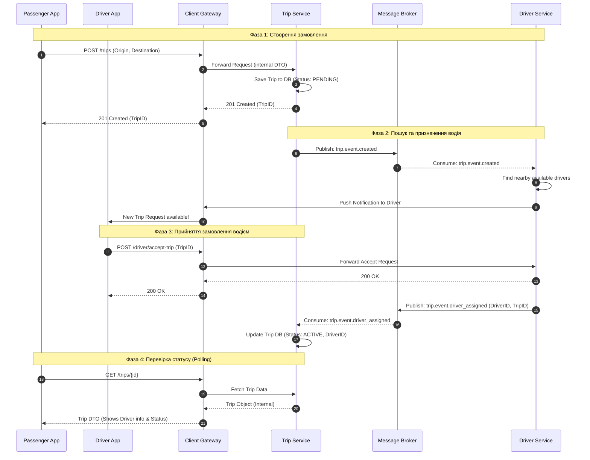

# Фаза 1: Створення замовлення
1.Пасажир надсилає запит на створення поїздки через POST /trips, вказуючи маршрут.

2.Client Gateway приймає запит та перенаправляє його до Trip Service.

3.Trip Service зберігає нову поїздку в базу даних із початковим статусом PENDING.

4.Trip Service повертає відповідь 201 Created разом із ідентифікатором поїздки (TripID).

5.Client Gateway передає підтвердження про створення поїздки назад у додаток пасажира.

# Фаза 2: Пошук та призначення водія
6.Trip Service публікує подію trip.event.created у брокер повідомлень (Message Broker).

7.Message Broker доставляє повідомлення сервісу водіїв (Driver Service).

8.Driver Service запускає внутрішній алгоритм пошуку найближчих доступних водіїв.

9.Driver Service надсилає запит на Gateway для відправки Push-повідомлення водію.

10.Client Gateway доставляє сповіщення про нове замовлення в додаток водія.

# Фаза 3: Прийняття замовлення водієм
11.Водій погоджується на поїздку, надсилаючи запит POST /driver/accept-trip.

12.Client Gateway перенаправляє запит на прийняття замовлення до Driver Service.

13.Driver Service підтверджує успішну обробку запиту (відповідь 200 OK).

14.Client Gateway передає статус успішного прийняття замовлення в додаток водія.

15.Driver Service публікує подію trip.event.driver_assigned у Message Broker.

16.Message Broker передає інформацію про призначеного водія до Trip Service.

17.Trip Service оновлює дані в базі: встановлює статус ACTIVE та записує ID водія.

# Фаза 4: Перевірка статусу (Polling)
18.Додаток пасажира робить запит GET /trips/{id} для оновлення статусу поїздки (polling).

19.Client Gateway пересилає запит на отримання актуальних даних до Trip Service.

20.Trip Service повертає внутрішній об'єкт поїздки з актуальними даними з бази.

21.Client Gateway повертає пасажиру фінальний об'єкт (DTO) з інформацією про водія та статусом поїздки.
