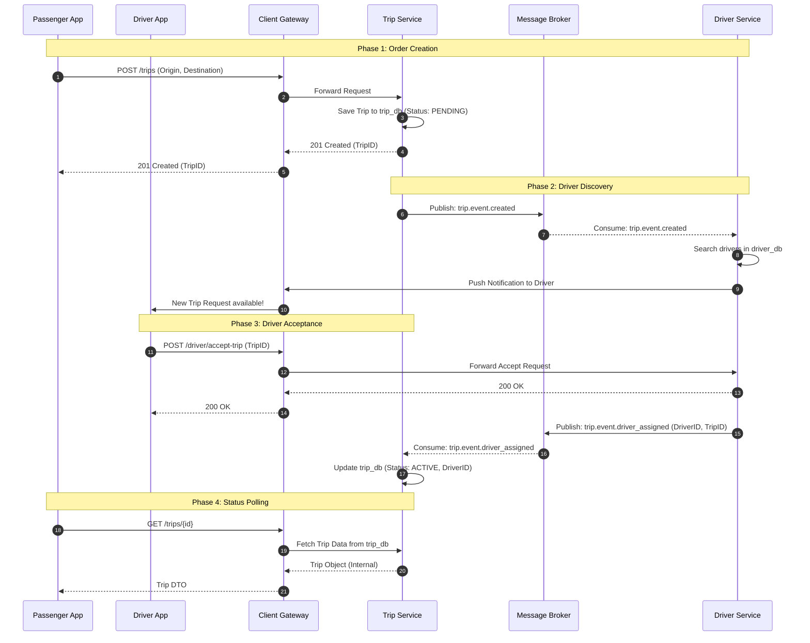

# Phase 1: Order Creation
The process begins when a passenger initiates a request for a ride.

1. POST /trips: The Passenger App sends a request containing the origin and destination coordinates to the Client Gateway.

2. Forward Request: The Client Gateway acts as a reverse proxy and routes the request to the Trip Service.

3. Save Trip: The Trip Service persists the new trip record into the trip_db with an initial status of PENDING.

4. 201 Created (TripID): The Trip Service returns a success response with the generated TripID to the Gateway.

5. 201 Created: The Client Gateway passes the success response back to the Passenger App, confirming the order is placed.

# Phase 2: Driver Discovery
The system asynchronously searches for and notifies nearby drivers.

6. Publish Event: The Trip Service publishes a trip.event.created message to the Message Broker (e.g., RabbitMQ or Kafka).

7. Consume Event: The Driver Service, which is subscribed to this topic, consumes the event.

8. Search Drivers: The Driver Service queries its local driver_db to find available drivers within the proximity of the trip origin.

9. Push Notification: The Driver Service sends a request to the Client Gateway to trigger a push notification.

10. New Trip Request: The Client Gateway delivers the notification to the Driver App.

# Phase 3: Driver Acceptance
The transition from a pending trip to an active trip once a driver agrees to the request.

11. POST /driver/accept-trip: The Driver App sends an acceptance request with the TripID to the Client Gateway.

12. Forward Accept: The Gateway routes the acceptance logic to the Driver Service.

13. 200 OK: The Driver Service confirms the operation to the Gateway.

14. 200 OK: The Driver App receives confirmation that they have successfully taken the trip.

15. Publish assigned event: The Driver Service emits a trip.event.driver_assigned event containing the DriverID and TripID.

16. Consume assigned event: The Trip Service consumes the event from the Message Broker.

17. Update trip_db: The Trip Service updates the trip record status to ACTIVE and links the specific DriverID to the trip.

# Phase 4: Status Polling
How the Passenger App stays updated on the trip's progress.

18. GET /trips/{id}: The Passenger App periodically polls the Client Gateway to check the status of the ride.

19. Fetch Trip Data: The Gateway forwards the request to the Trip Service.

20. Internal Object: The Trip Service retrieves the latest state from the trip_db.

21. Trip DTO: The Client Gateway transforms the internal data into a Data Transfer Object (DTO) and returns it to the Passenger App to update the UI.
