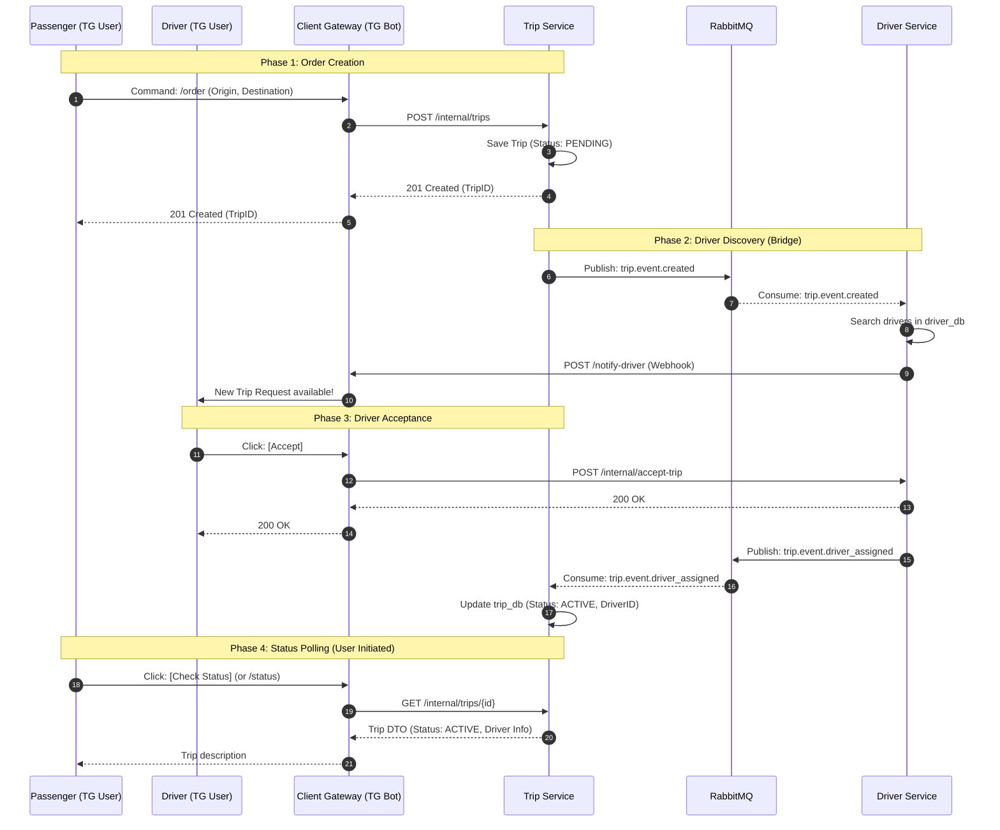

```mermaid
sequenceDiagram
    autonumber
    participant P as Passenger (TG User)
    participant D as Driver (TG User)
    participant CG as Client Gateway (TG Bot)
    participant TS as Trip Service
    participant MB as RabbitMQ
    participant DS as Driver Service

    Note over P, TS: Phase 1: Order Creation
    P->>CG: Command: /order (Origin, Destination)
    CG->>TS: POST /internal/trips
    TS->>TS: Save Trip (Status: PENDING)
    TS-->>CG: 201 Created (TripID)
    CG-->>P: 201 Created (TripID)

    Note over TS, DS: Phase 2: Driver Discovery (Bridge)
    TS->>MB: Publish: trip.event.created
    MB-->>DS: Consume: trip.event.created
    DS->>DS: Search drivers in driver_db
    DS->>CG: POST /notify-driver (Webhook)
    CG->>D: New Trip Request available!

    Note over D, TS: Phase 3: Driver Acceptance
    D->>CG: Click: [Accept]
    CG->>DS: POST /internal/accept-trip
    DS-->>CG: 200 OK
    CG-->>D: 200 OK
    
    DS->>MB: Publish: trip.event.driver_assigned
    MB-->>TS: Consume: trip.event.driver_assigned
    TS->>TS: Update trip_db (Status: ACTIVE, DriverID)

    Note over P, TS: Phase 4: Status Polling (User Initiated)
    P->>CG: Click: [Check Status] (or /status)
    CG->>TS: GET /internal/trips/{id}
    TS-->>CG: Trip DTO (Status: ACTIVE, Driver Info)
    CG-->>P: Trip description
```

# Phase 1: Order Creation

1. **Passenger Command:** The Passenger sends a /order command to the Telegram Bot (Client Gateway), including their origin and destination coordinates.

2. **Internal Request:** The Client Gateway parses the message and makes a synchronous POST /internal/trips request to the Trip Service.

3. **Persist Pending Trip:** The Trip Service saves the trip details into its database (trip_db) with an initial status of PENDING.

4. **Service Confirmation:** The Trip Service returns a 201 Created response containing the unique TripID to the Gateway.

5. **User Acknowledgment:** The Client Gateway sends a Telegram message back to the Passenger confirming that the order has been received.

# Phase 2: Driver Discovery

6. **Emit Creation Event:** The Trip Service publishes a trip.event.created message to RabbitMQ to initiate the driver matching process.

7. **Consume Creation Event:** The Driver Service consumes the trip.event.created message from the broker.

8. **Driver Match Logic:** The Driver Service queries its database (driver_db) to identify available drivers within a specific radius of the passenger's origin.

9. **Trigger Notification:** The Driver Service makes an internal POST /notify-driver Webhook call to the Client Gateway for each matched driver.

10. **Driver Push:** The Client Gateway sends a Telegram message with an "Accept" button to the matched Driver(s).

# Phase 3: Driver Acceptance

11. **Driver Action:** The Driver clicks the [Accept] button in their Telegram chat.

12. **Acceptance Request:** The Client Gateway captures the click and sends a POST /internal/accept-trip request to the Driver Service.

13. **Internal Confirmation:** The Driver Service validates the request and returns a 200 OK to the Gateway.

14. **Driver Feedback:** The Client Gateway notifies the Driver via Telegram that they have successfully accepted the trip.

15. **Emit Assignment Event:** The Driver Service publishes a trip.event.driver_assigned message to RabbitMQ, containing the DriverID and TripID.

16. **Consume Assignment Event:** The Trip Service consumes the trip.event.driver_assigned message.

17. **Activate Trip:** The Trip Service updates the trip record in trip_db, changing the status to ACTIVE and linking the specific DriverID.

# Phase 4: Status Polling (User Initiated)

18. **Status Request:** The Passenger, wanting an update, clicks a [Check Status] button or sends a /status command.

19. **Fetch Data:** The Client Gateway makes a synchronous GET /internal/trips/{id} call to the Trip Service.

20. **Data Transfer:** The Trip Service retrieves the active trip data (including driver info) and returns a Trip DTO (Data Transfer Object) to the Gateway.

21. **Final Update:** The Client Gateway formats the data into a human-readable "Trip description" (e.g., "Driver found! Your car is a Toyota Prius") and sends it to the Passenger.
