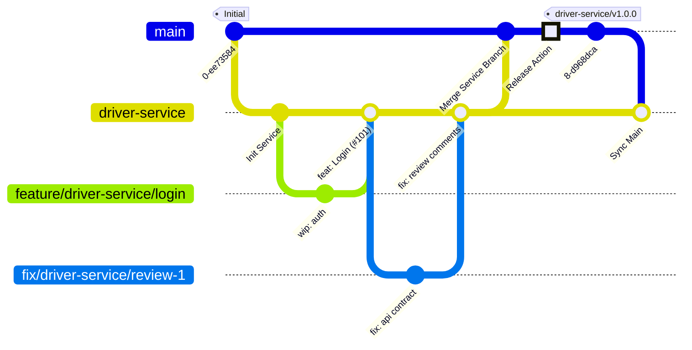

# Development Workflow

This project utilizes a **Service-Integration Workflow**. This approach allows each service team (`client-gateway`, `driver-service`, `trip-service`) to develop features autonomously while ensuring strict stability checks before code reaches production.

## Branching & Tagging Strategy

The repository is organized into three tiers of branches. Please adhere to the naming conventions below.

| Tier | Branch Name / Pattern | Description |
| :--- | :--- | :--- |
| **Production** | `main` | The stable state. Merges here update the `latest` image. |
| **Integration** | `client-gateway`, `driver-service`, `trip-service` | Long-lived branches for each team. Pushes here update the `dev` image. |
| **Development** | `feature/<service>/<name>`, `fix/<service>/<name>` | Temporary branches for specific tasks. |
| **Releases** | `<service>/v<X.Y.Z>` | **Git Tags** created via GitHub Releases (e.g., `driver-service/v1.0.0`). |

> **Example:** A feature for the driver service should be named `feature/driver-service/jwt-auth`.

---

## Workflow Lifecycle

### 1. Internal Development (Feature → Service Branch)

This phase is managed entirely within the service team.

1. **Create a Branch:** Always branch off your specific service branch (e.g., `driver-service`), **not** `main`.
```bash
git checkout driver-service
git pull origin driver-service
git checkout -b feature/driver-service/add-new-calculation
```

2. **Open Pull Request:** Target your service branch (`driver-service`).
3. **Peer Review:** Request a review from a teammate working on the same service.
4. **Merge Strategy:** 🟪 **Squash and Merge**.
* **Requirement:** Ensure the commit message references the issue (e.g., `feat: implement calculation logic (#101)`).
* **Result:** This updates the `dev` Docker image for your service.


### 2. Integration (Service Branch → Main)

When features are stable and ready for production, they are integrated into the main codebase.

1. **Open Pull Request:** Target `main` from your service branch.
* **Title:** `Integration: <Service Name> <Sprint/Batch>`
* **Description:** List all features included in this batch (e.g., `Closes #101, Closes #105`).


2. **Cross-Team Review:** Request a review from a developer belonging to a **different service team**.
* *Focus:* API contract changes, database migrations, and potential side effects.


3. **Review Fixes:** If changes are requested during the cross-team review:
* Create a fix branch from the *service branch* (e.g., `fix/driver-service/review-comments`).
* Commit fixes and merge it back into the *service branch*.
* The PR to `main` will update automatically with these fixes.


4. **Merge Strategy:** 🟦 **Create a Merge Commit** (Standard Merge).
* **⚠️ IMPORTANT:** **DO NOT Squash.** Preserve history to ensure Git understands the service branch has been merged.
* **Result:** This updates the `latest` Docker image, but **does not** create a specific versioned release.


### 3. Release Publishing (GitHub UI)

Releases are not automatic upon merging. When you are ready to publish a stable version, use the GitHub interface.

1. **Navigate to Releases:** Go to the repository's main page and click "Releases" (or "Create a new release").
2. **Draft a New Release:**
* **Choose a Tag:** Create a new tag following the pattern: `<service-name>/v<version>` (e.g., `driver-service/v1.0.1`).
* **Target:** Select `main`.
* **Title:** `<Service Name> v<Version>`
* **Description:** Click "Generate release notes" or manually list the changes.


3. **Publish Release:**
* Clicking "Publish" creates the Git tag automatically.
* **Result:** This triggers the CI pipeline to build and push the specific versioned package (e.g., `driver-service:v1.0.1`).


### 4. Synchronization (Sync Back)

Immediately after the integration into `main`, the service branch must be synchronized.

```bash
git checkout driver-service
git pull origin main
git push origin driver-service

```

---

## Visual Reference

The following diagram illustrates the lifecycle of a feature, the fix loop during integration, and the **GitHub Release** step.



## Summary Checklist

| Action | Source | Target | Merge Type | Result |
| --- | --- | --- | --- | --- |
| **Submit Feature** | `feature/...` | `service-branch` | **Squash Merge** | Updates `dev` image |
| **Integrate** | `service-branch` | `main` | **Merge Commit** | Updates `latest` image |
| **Review Fixes** | `fix/...` | `service-branch` | **Squash/Merge** | Updates Integration PR |
| **Release** | GitHub UI | `main` | **Create Tag** | Publishes `vX.Y.Z` image |
| **Sync** | `main` | `service-branch` | **Merge/Pull** | Keeps branches aligned |
