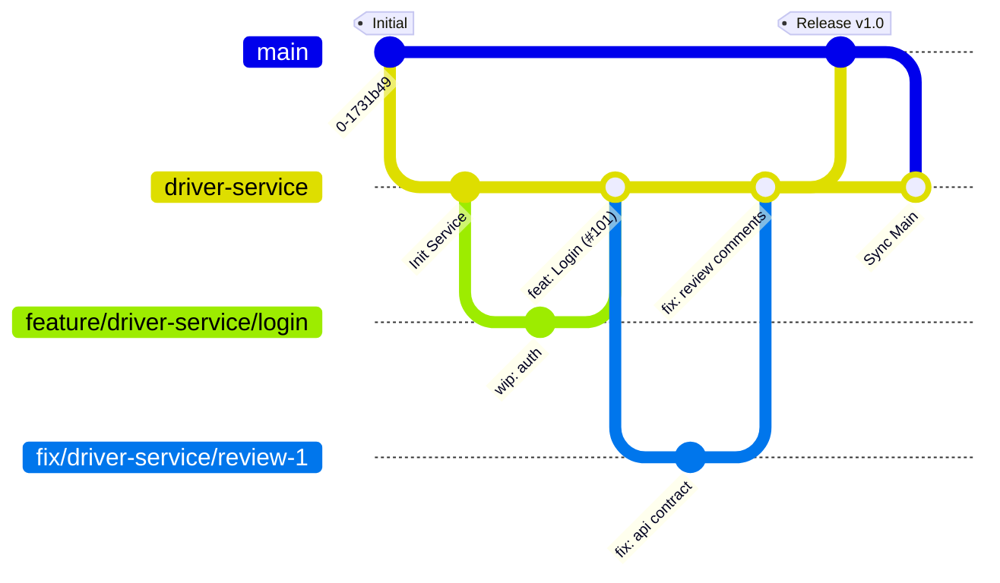

# Development Workflow

This project utilizes a **Service-Integration Workflow**. This approach allows each service team (`client-gateway`, `driver-service`, `trip-service`) to develop features autonomously while ensuring strict stability checks before code reaches production.

## Branching Strategy

The repository is organized into three tiers of branches. Please adhere to the naming conventions below.

| Tier | Branch Name / Pattern | Description |
| :--- | :--- | :--- |
| **Production** | `main` | The stable, production-ready state of the system. |
| **Integration** | `client-gateway`, `driver-service`, `trip-service` | Long-lived branches for each team. Features are accumulated here before release. |
| **Development** | `feature/<service>/<name>`, `fix/<service>/<name>` | Temporary branches for specific tasks. Created from the service branch. |

> **Example:** A feature for the driver service should be named `feature/driver-service/jwt-auth`.

---

## Workflow Lifecycle

### 1. Internal Development (Feature → Service Branch)

This phase is managed entirely within the service team.

1. **Create a Branch:** Always branch off your specific service branch (e.g., `driver-service`), **not** `main`.
```bash
git checkout driver-service
git pull origin driver-service
git checkout -b feature/driver-service/add-new-calculation

```


2. **Open Pull Request:** Target your service branch (`driver-service`).
3. **Peer Review:** Request a review from a teammate working on the same service.
4. **Merge Strategy:** 🟪 **Squash and Merge**.
* **Requirement:** Ensure the commit message references the issue (e.g., `feat: implement calculation logic (#101)`).
* **Why?** This keeps the service branch history clean, representing a list of completed features rather than work-in-progress commits.


### 2. Release to Production (Service Branch → Main)

When a set of features is ready for release, any team member can initiate the integration process.

1. **Open Pull Request:** Target `main` from your service branch.
* **Title:** `Release: <Service Name> <Version/Sprint>`
* **Description:** List all features included in this batch using keywords to close issues (e.g., `Closes #101, Closes #105`).


2. **Cross-Team Review:** Request a review from a developer belonging to a **different service team**.
* *Focus:* API contract changes, database migrations, and potential side effects on other services.


3. **Review Fixes:** If changes are requested:
* Create a fix branch from the service branch (e.g., `fix/driver-service/review-comments`).
* Merge it back into the service branch.
* The PR to `main` will update automatically.


4. **Merge Strategy:** 🟦 **Create a Merge Commit** (Standard Merge).
* **⚠️ IMPORTANT:** **DO NOT Squash.** You must preserve the history to ensure git understands the service branch has been merged. Squashing here will cause conflict loops later.


### 3. Synchronization (Sync Back)

Immediately after the release is merged into `main`, the service branch must be synchronized.

1. Checkout your service branch.
2. Pull the latest changes from `main`.
3. Push back to the remote.

```bash
git checkout driver-service
git pull origin main
git push origin driver-service

```

---

## Visual Reference

The following diagram illustrates the lifecycle of a feature, the release process, and the critical merge strategies used at each step.



## Summary Checklist

| Action | Source Branch | Target Branch | Merge Type | Reviewer |
| --- | --- | --- | --- | --- |
| **Submit Feature** | `feature/...` | `service-branch` | **Squash Merge** | Same Team |
| **Release** | `service-branch` | `main` | **Merge Commit** | Other Team |
| **Sync** | `main` | `service-branch` | **Merge/Pull** | N/A |
